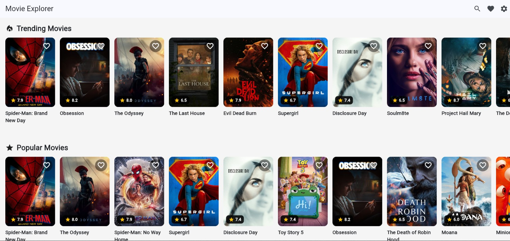
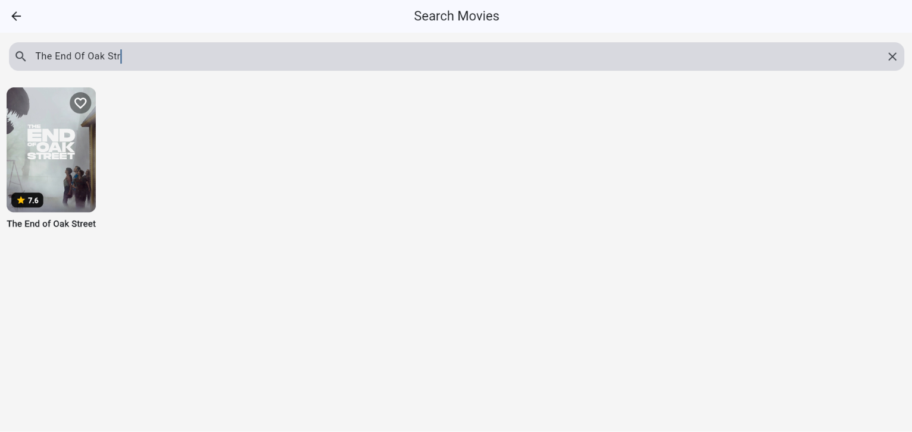
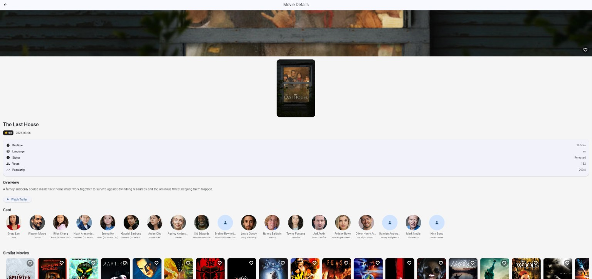
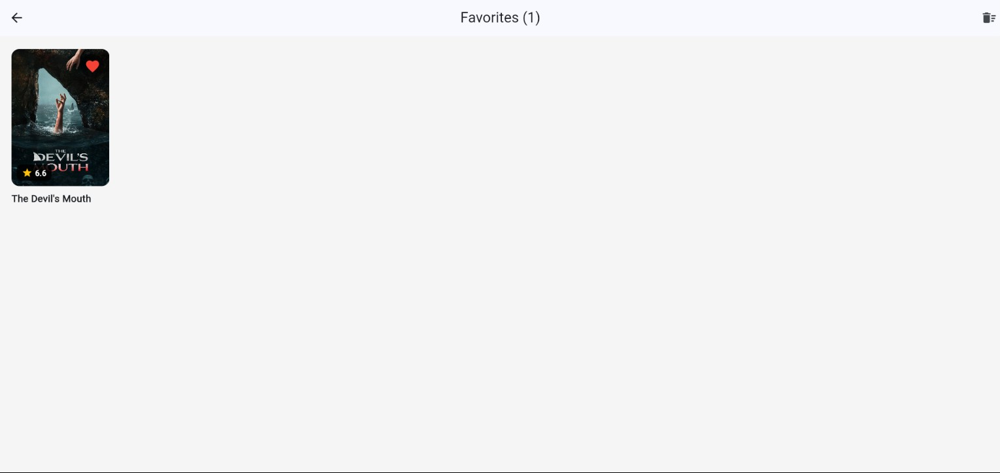
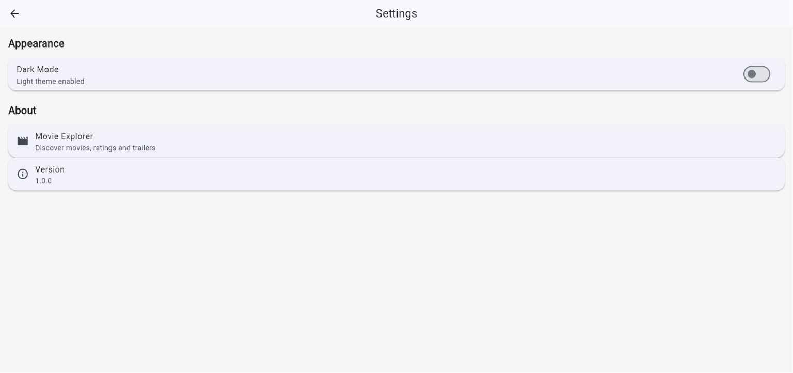
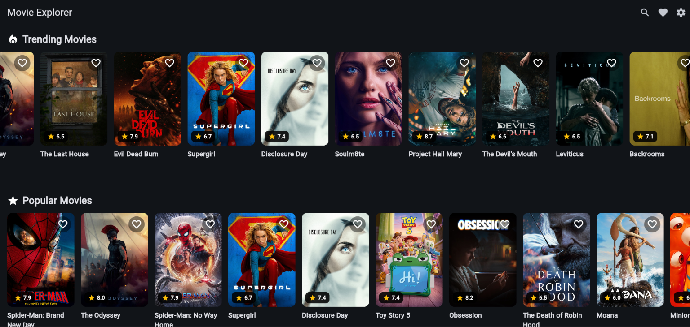

# 🎬 Flutter Movie Explorer

<p align="center">
  A modern Flutter movie discovery application powered by the <b>TMDB API</b>.
</p>

<p align="center">
  <b>Discover • Search • Explore • Favorite • Watch</b>
</p>

---

## 📱 Overview

**Flutter Movie Explorer** is a cross-platform movie discovery application built with **Flutter and Dart**.

It allows users to discover popular and trending movies, search for movies, explore detailed information, view cast members, watch trailers, browse similar movies, save favorites, and switch between light and dark themes.

The application follows a clean layered architecture using **Provider, Repository Pattern, REST API integration, reusable widgets, and local persistence**.

---

## ✨ Features

### 🎬 Movie Discovery

* Popular and trending movies
* Movie posters, ratings, release dates and overviews
* Dedicated movie details screen
* Similar movie recommendations

### 🔎 Smart Search

* Search movies by title
* Responsive movie grid
* Pagination and load-more support
* Empty and error states
* Retry failed requests
* Clear search functionality

### 🎞️ Movie Details

* Movie overview and rating
* Release date and runtime
* Genres and status
* Tagline and homepage
* Poster and backdrop images
* Cast and character information
* Official trailer
* Similar movies

### ❤️ Favorites

* Add/remove favorite movies
* Dedicated Favorites screen
* Persistent favorites
* Synchronized favorite state across screens

### 🌙 Themes

* Light mode
* Dark mode
* Persistent theme preference

### ⚡ Performance & UX

* Cached network images
* Loading states
* Error handling
* Retry functionality
* Empty states
* Reusable UI components

---

## 🏗️ Architecture

The application follows a **layered architecture** that separates UI, state management, repositories, services, and data models.

```text
┌──────────────────────────────┐
│          Flutter UI          │
│  Screens + Reusable Widgets  │
└──────────────┬───────────────┘
               ↓
┌──────────────────────────────┐
│       Provider Layer         │
│ Home • Search • Details      │
│ Favorites • Theme            │
└──────────────┬───────────────┘
               ↓
┌──────────────────────────────┐
│      Repository Layer        │
│     IMovieRepository         │
│      MovieRepository         │
└──────────────┬───────────────┘
               ↓
┌──────────────────────────────┐
│        Service Layer         │
│  ApiService • StorageService │
└──────────────┬───────────────┘
               ↓
        ┌──────┴──────┐
        ↓             ↓
   TMDB REST API   SharedPreferences
```

### Data Flow

```text
UI
 ↓
Provider
 ↓
Repository
 ↓
API Service
 ↓
TMDB API
 ↓
Dart Models
 ↓
Provider
 ↓
UI
```

---

## 🛠️ Tech Stack

| Technology               | Purpose                                |
| ------------------------ | -------------------------------------- |
| **Flutter**              | Cross-platform application development |
| **Dart**                 | Programming language                   |
| **Provider**             | State management                       |
| **TMDB API**             | Movie data and metadata                |
| **REST API**             | Network communication                  |
| **HTTP**                 | API requests                           |
| **SharedPreferences**    | Local persistence                      |
| **Cached Network Image** | Image caching                          |
| **URL Launcher**         | External trailer links                 |
| **Material Design**      | User interface                         |
| **Git / GitHub**         | Version control                        |

### Main Packages

```yaml
provider
http
cached_network_image
shared_preferences
url_launcher
flutter_dotenv
cupertino_icons
```

---

## 📁 Project Structure

```text
movie_explorer/
│
├── lib/
│   ├── core/
│   │   ├── api_constants.dart
│   │   ├── api_endpoints.dart
│   │   ├── app_theme.dart
│   │   ├── exceptions.dart
│   │   └── view_state.dart
│   │
│   ├── models/
│   │   ├── api_response.dart
│   │   ├── cast.dart
│   │   ├── genre.dart
│   │   ├── movie.dart
│   │   └── video.dart
│   │
│   ├── providers/
│   │   ├── favorites_provider.dart
│   │   ├── home_provider.dart
│   │   ├── movie_details_provider.dart
│   │   ├── search_provider.dart
│   │   └── theme_provider.dart
│   │
│   ├── repositories/
│   │   ├── i_movie_repository.dart
│   │   └── movie_repository.dart
│   │
│   ├── routes/
│   ├── screens/
│   ├── services/
│   ├── utils/
│   ├── widgets/
│   │
│   └── main.dart
│
├── assets/
├── test/
├── android/
├── ios/
├── linux/
├── macos/
├── web/
├── windows/
│
├── .gitignore
├── analysis_options.yaml
├── pubspec.yaml
└── README.md
```

---

## 🚀 Getting Started

### Prerequisites

Make sure you have installed:

* Flutter SDK
* Dart SDK
* Android Studio or VS Code
* Git
* A TMDB API key

### 1. Clone the Repository

```bash
git clone https://github.com/your-username/movie-explorer.git
cd movie-explorer
```

### 2. Install Dependencies

```bash
flutter pub get
```

### 3. Configure TMDB API

Create a `.env` file in the project root and add your TMDB API key:

```env
TMDB_API_KEY=your_api_key_here
```

> Never commit your `.env` file or expose your API key publicly.

### 4. Run the Application

```bash
flutter run
```

---

## 🖼️ Screenshots

> Add your application screenshots inside the `screenshots/` directory.

| Home                          | Search                            |
| ----------------------------- | --------------------------------- |
|  |  |

| Movie Details                       | Favorites                               |
| ----------------------------------- | --------------------------------------- |
|  |  |

| Settings                              | Dark Theme                                |
| ------------------------------------- | ----------------------------------------- |
|  |  |

---

## 🔐 API

Movie data is provided by **The Movie Database (TMDB)**.

The application uses TMDB for:

* Movie discovery
* Movie search
* Movie details
* Cast information
* Trailers
* Similar movies
* Movie images

---

## 🧪 Project Quality

The project is structured with maintainability and scalability in mind:

* Separation of responsibilities
* Repository abstraction
* Provider-based state management
* Strongly typed Dart models
* Centralized API services
* Reusable widgets
* Structured error handling
* Local data persistence
* Cached network images

---

## 🔮 Future Improvements

Potential future enhancements include:

* 🔐 Firebase authentication
* ☁️ Cloud favorite synchronization
* 🤖 AI-powered movie recommendations
* ⭐ User reviews and ratings
* 📥 Offline movie data
* 🔔 Push notifications
* 🎥 In-app trailer playback
* 🌍 Multi-language support
* ♿ Improved accessibility
* 🧪 Automated testing
* 📊 Analytics and crash monitoring

---

## 📄 License

This project is developed for educational and portfolio purposes.

---

<p align="center">
  Made with ❤️ using Flutter & Dart
</p>
